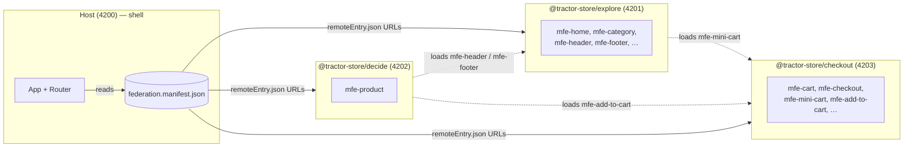

# Tractor Store — Documentation

The Tractor Store is a four-app micro-frontend (MFE) system: a thin
**host** shell plus three independently-deployed **remotes**, each
owned by a separate team. The host owns the URL and the page chrome;
the remotes ship UI as web components and link to each other through
_intent IDs_ instead of hard-coded URLs. All composition happens at
runtime — there is no build-time wiring between apps.

The runtime is [Native Federation v4][nf]. It is built on ECMAScript
Modules and Import Maps, so what we ship is plain browser-native code
with a small orchestration layer on top.

[nf]: https://native-federation.com/

## New to micro-frontends?

A micro-frontend architecture splits a single web application into
smaller apps that can be built, tested, and deployed independently.
Each team owns its slice end-to-end and the browser composes them at
runtime.

This project follows the [Tractor Store Blueprint][blueprint] — a
reference scenario for comparing MFE techniques across frameworks.
The teams are named for what they do in the customer journey
(**Explore**, **Decide**, **Checkout**), not for technical layers.
That vertical split is the canonical micro-frontends decomposition
described on [micro-frontends.org][mfo].

Three ideas carry the weight in this repo:

1. **Custom elements** (web components). Every UI fragment a remote
   exposes is registered as a `<mfe-*>` HTML tag. The host (or any
   other remote) places that tag in the DOM and the browser does the
   rest. The contract is plain HTML — no Angular import crosses team
   boundaries.
2. **A central event bus** (`window.__NF_REGISTRY__`). Remotes
   publish and subscribe to small, _typed_ channels instead of
   calling each other directly. Each channel is defined once with
   `defineChannel<Payload>(name)` in `@tractor-store/shared`;
   emitter and listener then share the same compile-time contract.
   Navigation, store selection, and cart sync all ride on this bus.
3. **Intent-based navigation.** A button in the _decide_ micro frontend that should
   open the cart never types `'/checkout/cart'`. It uses the
   `[appNavigateTo]` directive with the intent `'checkout.cart'`,
   and the host translates that to a URL. A team can rename its
   routes without touching anyone else's code.

Together these three keep the apps decoupled. The rest of this doc
set explains how each piece is implemented.

[blueprint]: https://github.com/neuland/tractor-store-blueprint
[mfo]: https://micro-frontends.org/

## At a glance

The manifest is the only static "wiring": every app fetches it at
startup and uses it to locate the others. The dotted lines are
_cross-remote fragment loads_ — a remote can mount another remote's
custom element inside its own page without going through the host.

## Read next

- **[Architecture](./architecture.md)** — what the host owns, what
  each remote owns, and the three decoupling mechanisms (custom
  elements, the event bus, intent-based navigation) plus how the
  shared library is scoped.
- **[Navigation](./navigation.md)** — the intent-based navigation
  system and why it is the load-bearing piece of the host/remote
  decoupling.
- **[Features](./features.md)** — what each team ships, the
  fragments they expose, the events they emit, and the cross-remote
  dependencies between them.

## Where does X live?

| Concern                                      | File / module                                                                 |
| -------------------------------------------- | ----------------------------------------------------------------------------- |
| Bootstrap & federation init (every app)      | `libs/shared/src/start/start.ts` (`startFederation`), called from `projects/<app>/src/main.ts` |
| Host DI providers & Router setup             | `projects/host/src/app/app.config.ts`                                         |
| App-initializer that loads contributions     | `projects/host/src/app/nav/remote-navigation.ts` (`provideRemoteNavigation`)  |
| Building routes from contributions           | `projects/host/src/app/nav/remote-routes.ts` (`buildRemoteRoutes`)            |
| Building the intent map                      | `projects/host/src/app/nav/remote-navigation.ts` (`buildIntentMap`)           |
| Loading a remote's custom element            | `libs/shared/src/start/remote-loader.ts` (`createRemoteLoader`)               |
| Embedding a foreign `mfe-*` element          | `libs/shared/src/federation/remote-element.directive.ts` (`[mfeRemote]`)      |
| `ENV` / `LOAD_REMOTE` tokens                 | `libs/shared/src/federation/env.ts`, `remote-loader.ts`, `provide-env.ts`     |
| CDN image loader (`ngSrc`)                   | `libs/shared/src/ui/cdn-image-loader.ts`                                      |
| Host route → element mount                   | `projects/host/src/app/loader/remote-shell.component.ts`                      |
| Cross-MFE link directive (`[appNavigateTo]`) | `libs/shared/src/nav/navigate-to.directive.ts`                                |
| Intent → URL resolution                      | `libs/shared/src/nav/intent-url.ts` (`resolveIntentUrl`)                      |
| Event-bus channel factory                    | `libs/shared/src/bus/channel.ts` (`defineChannel`, `defineResource`, `listenTo`) |
| Navigation channels                          | `libs/shared/src/bus/nav-channels.ts` (`nav:navigate`, `nav:intents`)         |
| Store-selected channel                       | `libs/shared/src/bus/store-channels.ts` (`store:selected`)                    |
| Cross-instance cart sync                     | `projects/checkout/src/core/data/store/cart-bus.ts` (`cart:updated`)          |
| Path/query helpers (shared)                  | `libs/shared/src/nav/path-template.ts`, `query.ts`, `route-params.ts`         |
| `NavPayload` / `RouteParams` types           | `libs/shared/src/nav/nav-payload.ts`, `route-params.ts`                       |
| Nav contribution / intent map types          | `libs/shared/src/nav/contribution.ts`                                         |
| Remote bootstrap (custom-element)            | `projects/<remote>/src/features/<feature>/bootstrap.ts`                       |
| Per-remote Angular application               | `projects/<remote>/src/core/remote-app.ts` (`defineRemoteApp`)                |
| Remote nav contribution                      | `projects/<remote>/src/core/nav-contribution.ts`                              |
| Fake event bus for tests                     | `libs/shared/src/testing/install-registry-stub.ts`                            |
| Federation config (per app)                  | `projects/<app>/federation.config.mjs`                                        |
| Runtime remote discovery                     | `projects/<app>/public/federation.manifest.json`                              |
| Per-environment values                       | `projects/<app>/public/env.config.json`                                       |
| Team boundary visualisation overlay          | `public/cdn/js/helper.js`                                                     |
