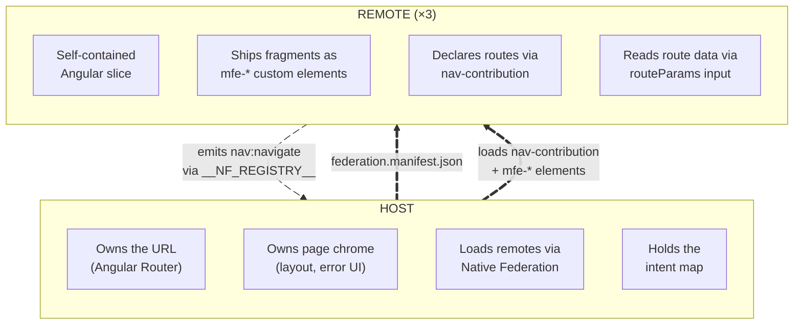
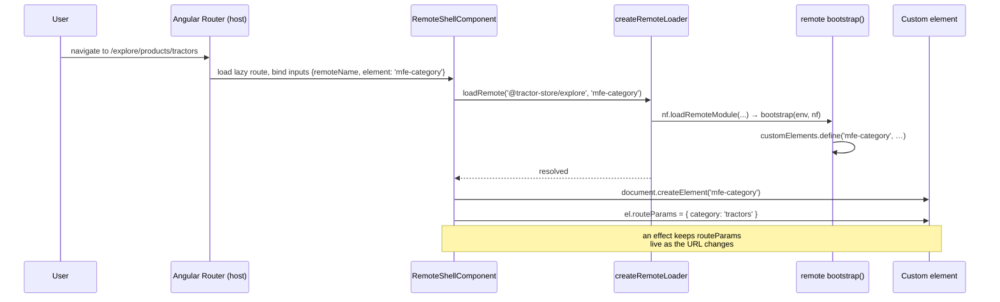
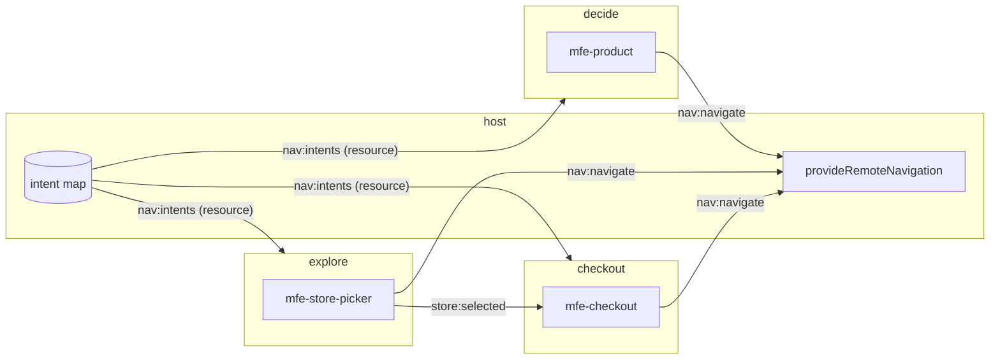
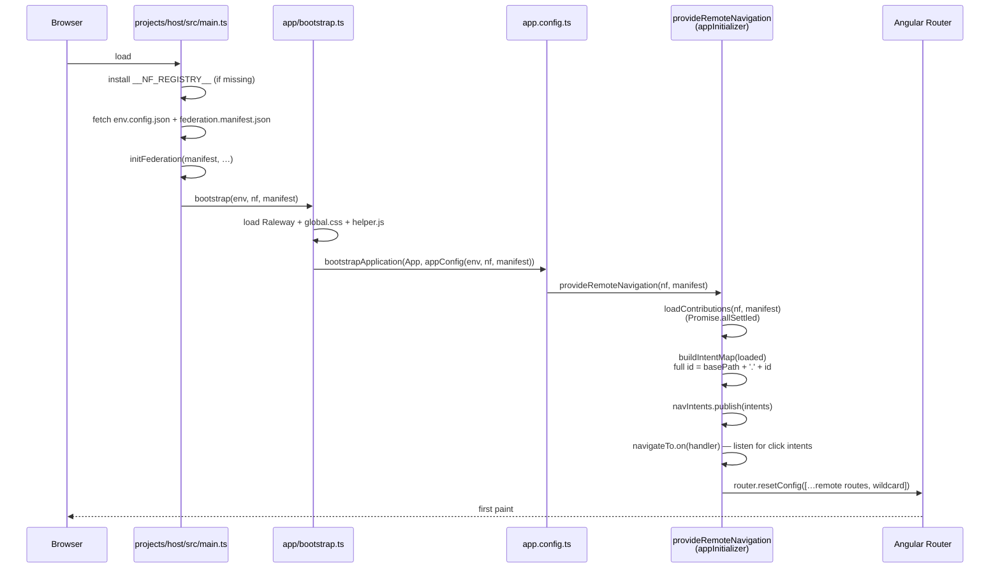

# Architecture

This document explains the contract between the host and the remotes —
what each side owns, where the boundary sits, and how the three
decoupling mechanisms (custom elements, the event bus, intent-based
navigation) make runtime composition possible without coupling the apps
together. A short note on the shared library closes it out.

## Why decoupling matters

Three teams ship three Angular applications into one page. The
architecture has one job: keep those teams independent. _Independent_
means a team can rename a route, swap an internal component, or roll a
backend change forward without coordinating with the other teams.

Whenever two MFEs talk to each other directly — by importing types,
sharing a `Router`, or calling each other's services — they pick up a
hidden dependency that turns "deploy whenever you want" into "deploy
whenever the other team is ready". The architecture below avoids that
by inserting an explicit, stable contract at every place where the apps
meet.

> Michael Geers, _micro-frontends.org_: "_Isolate Team Code — Don't
> share a runtime, even if all teams use the same framework. Build
> independent apps that are self-contained._"

## The two-layer model

Two layers, with a small, explicit contract between them.



The contract has exactly four touchpoints:

1. **`federation.manifest.json`** — the host's list of remote names →
   entry URLs, fetched at startup.
2. **`nav-contribution`** — a module each remote _exposes_ that
   declares its base path and the intents (routable destinations) it
   owns.
3. **`mfe-*` custom elements** — the actual UI fragments, also exposed
   via federation. The host instantiates them with
   `document.createElement`.
4. **`routeParams`** — a single property the host writes onto a
   mounted custom element, carrying parsed path and query parameters.

Nothing else is shared at the boundary. There is no `import` from a
remote in host code, no Angular service crossing the line, no shared
router state.

## The three decoupling mechanisms

### 1. Custom elements as the integration surface

A remote does not ship Angular components for the host to import. It
ships **custom elements** (web components) registered under stable
`mfe-*` tags via `@angular/elements`.

Each remote declares its Angular application once, and every feature
bootstrap is a single line:

```ts
// projects/explore/src/core/remote-app.ts
export const remoteApp = defineRemoteApp();

// projects/explore/src/features/header/bootstrap.ts
export const bootstrap = remoteApp.expose('mfe-header', HeaderComponent);
```

The browser's standard custom-element machinery does the integration.
Four consequences worth calling out:

- **Plain HTML is the contract.** A consumer drops `<mfe-cart>` in a
  template; nothing else is required. No Angular type, RxJS Observable,
  or service interface crosses the boundary.
- **One Angular per remote.** `defineRemoteApp`
  (`libs/shared/src/federation/remote-app.ts`) lazily creates a single
  Angular application on the first `expose`d bootstrap and reuses its
  injector for every feature in the same remote. When the host mounts
  `<mfe-home>` and `<mfe-header>` from explore, they share
  `HttpClient`, stores, and other DI-provided services — but nothing
  leaks across remotes. The cache lives in the `defineRemoteApp`
  closure, not at module level, because the shared library is a
  single instance used by all remotes.
- **Bootstrap is idempotent.** A `customElements.get(tag)` guard inside
  `expose` plus a matching check inside `createRemoteLoader`
  (`libs/shared/src/federation/remote-loader.ts`) make it safe to request
  the same fragment from many places. Only the first call defines the
  element; subsequent calls are no-ops.
- **Shadow DOM at the boundary only.** The exposed root components
  (the `mfe-*` pages and fragments, including the `AddToCartElement`
  wrapper) use `ViewEncapsulation.ShadowDom`. Internal components
  (`Button`, `Spinner`, tiles, line items, …) keep Angular's default
  emulated encapsulation; Angular copies their styles into the root's
  shadow root.

> Cam Jackson, _martinfowler.com_: "_Each micro frontend is to define
> an HTML custom element for the container to instantiate, instead of
> defining a global function for the container to call._"

#### Loading a fragment: `LoadRemote`

Every app loads remote fragments with the same function
(`libs/shared/src/federation/remote-loader.ts`):

```ts
export type LoadRemote = (remoteName: string, element: string) => Promise<void>;

export const createRemoteLoader =
  (env: EnvironmentConfig, nf: NativeFederationResult): LoadRemote =>
  async (remoteName, element) => {
    if (customElements.get(element)) return;
    const mod = await nf.loadRemoteModule<RemoteElementModule>(remoteName, element);
    await mod.bootstrap(env, nf);
  };
```

The loader lives in DI under the `LOAD_REMOTE` token
(`libs/shared/src/federation/remote-loader.ts`): the host provides it
in `projects/host/src/app/app.config.ts`, and `defineRemoteApp`
provides it inside each remote. Components never call it by hand.
They put the `RemoteElementDirective`
(`libs/shared/src/federation/remote-element.directive.ts`) on the tag
they want to embed, and the directive loads that element from the
named remote:

```html
<mfe-header mfeRemote="@tractor-store/explore"></mfe-header>
```

The loader hands `nf` (the federation runtime) to the remote's
bootstrap, and that remote builds its own loader from it. That is how
cross-remote loads work even when the host is not in the picture:
explore's header can contain
`<mfe-mini-cart mfeRemote="@tractor-store/checkout">` and it just
works.

#### Why a single `routeParams` property and not attributes

`HTMLElement` reserves a long list of property names (`id`, `slot`,
`title`, `hidden`, `style`, …). If the host wrote each route param as
its own attribute or property it would silently collide with
intrinsics — set `<mfe-cart id="abc">` and Angular would happily read
`''` because the DOM already owns `id`. Instead, all params land under
one well-known property (`routeParams`), and the remote reads them
through helpers in `libs/shared/src/nav/route-params.ts` (`param`,
`requiredParam`, `paramList`). Clean separation, zero collisions.

#### How a route activation lands a custom element on the page



`RemoteShellComponent` (`projects/host/src/app/loader/remote-shell.component.ts`)
follows exactly this script. `remoteName` and `element` are inputs
bound from the route data (`withComponentInputBinding`). A
`resource()` calls the loader and creates the element; while it is
loading the shell shows a spinner, and if the load fails it shows an
error message. `paramMap` + `queryParamMap` become signals
(`toSignal`) that a `computed` merges into one `routeParams` object
(with `equal: sameRouteParams`, so the element only sees a new object
when a value actually changed). An `effect` mounts the element and
assigns `routeParams`.

### 2. The event bus (`window.__NF_REGISTRY__`)

Custom elements solve composition: a remote can mount another remote's
UI. But composition alone is not enough — the remotes also need to
_talk_ to each other. They do that through a small, shared event bus
that each app's `main.ts` installs before Angular bootstraps.

The bus lives on `window.__NF_REGISTRY__`. In these docs it is always
called _the event bus_ (the host's intent ID → URL table is _the
intent map_, see [navigation.md](./navigation.md)). It is created at
the top of every app's `main.ts`, so a remote running standalone gets a
bus too:

```ts
window.__NF_REGISTRY__ ??= Object.freeze(
  createRegistry({ maxStreams: 20, maxEvents: 1, removePercentage: 0.25 })(),
);
```

It is the [event registry][nf-registry] of the Native Federation
orchestrator: event streams (`emit(name, data)` / `on(name, handler)`)
plus latched resources (`register(name, value)` / `onReady(name,
handler)`). On top of that, `libs/shared/src/bus/channel.ts` adds a
tiny abstraction so that a channel carries both its name **and** its
payload type in one place:

```ts
// An event stream. `replay` is how many past events a new subscriber receives.
export const defineChannel = <T>(
  name: string,
  { replay = 1 }: { replay?: number } = {},
): Channel<T> => ({
  emit: (payload) => bus().emit<T>(name, payload),
  on: (handler) => bus().on<T>(name, ({ data }) => handler(data), { replay }),
});

// A value that is set once; `on` fires synchronously when it is already there.
export const defineResource = <T>(name: string): Resource<T> => ({
  publish: (value) => void bus().register<T>(name, value),
  on: (handler) => bus().onReady<T>(name, handler),
});

// Subscribes for the lifetime of the current injection context.
export const listenTo = <T>(source: Subscribable<T>, handler: (value: T) => void): void => {
  inject(DestroyRef).onDestroy(source.on(handler));
};
```

`bus()` looks `window.__NF_REGISTRY__` up on every call, so channels
can be declared at module level before the bus exists. Every
cross-MFE channel is then declared in one line:

```ts
// libs/shared/src/bus/nav-channels.ts
export const navigateTo = defineChannel<NavigatePayload>('nav:navigate', { replay: 0 });
export const navIntents = defineResource<IntentMap>('nav:intents');

// libs/shared/src/bus/store-channels.ts
export const storeSelected = defineChannel<StoreSelectedPayload>('store:selected');
```

`navigateTo` uses `replay: 0` because a command must never be replayed
to a late subscriber. `navIntents` is a resource, so a link that
renders after the host published the intent map receives it
synchronously.

[nf-registry]: https://native-federation.com/docs/v4/orchestrator/event-registry

Both the emitter and the listener import the **same** channel handle,
so typos in the channel name and shape mismatches in the payload
become compile-time errors rather than silent runtime bugs.

> Cam Jackson, _martinfowler.com_: "_Custom events allow micro
> frontends to communicate indirectly, which is a good way to minimise
> direct coupling, though it does make it harder to determine and
> enforce the contract that exists between micro frontends._"

The typed channel handle is the answer to Jackson's caveat: each
channel's contract lives in one file that both ends import.

#### The channels in use today



| Channel          | Defined in                                          | Direction                 | Purpose                                                                         |
| ---------------- | --------------------------------------------------- | ------------------------- | ------------------------------------------------------------------------------- |
| `nav:navigate`   | `libs/shared/src/bus/nav-channels.ts`               | remote → host             | Intent-based navigation requests (used by `[appNavigateTo]`)                    |
| `nav:intents`    | `libs/shared/src/bus/nav-channels.ts`               | host → remotes (resource) | The intent map (`intentId → {basePath, path}`) so directives can render real `href`s |
| `store:selected` | `libs/shared/src/bus/store-channels.ts`             | explore → checkout        | Notify checkout when the user picks a pickup store                              |

State that stays inside one remote does not need the bus. All of
checkout's elements (`<mfe-cart>`, `<mfe-mini-cart>`,
`<mfe-add-to-cart>`, …) share one Angular application, so they share
one `CartStore` and its signals keep them in step. A second browser
tab is kept in sync by `CartStore` listening to the window's `storage`
events (`projects/checkout/src/core/data/store/cart-store.ts`).

The pattern generalises: when two MFEs need to coordinate on a piece
of state, declare a channel via `defineChannel<Payload>('name')` and
import the same handle on both sides. No singleton service, no shared
DI tree, no hidden imports.

### 3. Intent-based navigation

Custom elements compose UI. The event bus carries state. The
_navigation_ problem is bigger than either: every team wants to link
to pages owned by other teams, without hard-coding URLs that those
other teams may rename.

Each remote declares a `nav-contribution`
(`projects/<remote>/src/core/nav-contribution.ts`) listing its routable
intents:

```ts
// projects/checkout/src/core/nav-contribution.ts
export const navContribution: NavContribution = {
  basePath: 'checkout',
  intents: [
    { id: 'cart', path: '/cart', element: 'mfe-cart' },
    { id: 'checkout', path: '/checkout', element: 'mfe-checkout' },
    { id: 'thanks', path: '/thanks', element: 'mfe-thanks' },
  ],
};
```

The remote owns relative intent IDs (`cart`, `checkout`, `thanks`).
The host prepends each contribution's `basePath` when it registers
them, producing the public IDs other teams link to (`checkout.cart`,
etc.). Remotes link by intent, never by URL — and a directive in
`@tractor-store/shared` makes that ergonomic in templates. Full
walkthrough in [navigation.md](./navigation.md).

> Cam Jackson, _martinfowler.com_: "_Using the page URL for this
> purpose ticks many boxes … It's declarative, not imperative.
> I.e. 'this is where we are', rather than 'please do this thing'._"

The intent layer is what makes that declarative-URL model work
_without_ every team having to know every other team's URL scheme.

## The bootstrap chain

How a host page comes alive, end to end:



Every app's `main.ts` does the same three steps; only the last line
differs. The host bootstraps its Angular app, a standalone remote
bootstraps its default page with `bootstrap(env, nf)`. `main.ts`
imports nothing from `@tractor-store/shared`: it runs before the import
map exists, so shared code is only reached through the dynamically
imported bootstrap. Two artefacts drive everything, both fetched with
`cache: 'no-cache'`:

- **`env.config.json`** — per-environment values: `apiUrl`, `cdnUrl`,
  `production`. Same shape across all four apps. CI rewrites
  it for the deployed environment, so the same build works locally
  and on GitHub Pages.
- **`federation.manifest.json`** — the discovery file:

  ```json
  {
    "@tractor-store/explore": "http://localhost:4201/remoteEntry.json",
    "@tractor-store/decide": "http://localhost:4202/remoteEntry.json",
    "@tractor-store/checkout": "http://localhost:4203/remoteEntry.json"
  }
  ```

  Each value is the URL of a remote's `remoteEntry.json` — the
  import-map fragment Native Federation publishes during build.
  `initFederation` merges all of them into the page's import map so
  any subsequent `nf.loadRemoteModule(remoteName, exposedModule)`
  resolves to the right bundle.

`__NF_REGISTRY__` is installed _before_ federation init, so remotes
that touch the bus during their own bootstrap always find it there.

## Native Federation vs. Module Federation

Native Federation is the standards-based alternative to webpack's
Module Federation. It implements the same mental model — remotes
publish a `remoteEntry`, the host imports modules from named remotes
at runtime — on top of ECMAScript Modules and Import Maps instead
of webpack runtime, so it works with esbuild/Vite/Rspack and aligns
with Angular 17+'s default builder.

> Manfred Steyer, _Announcing Native Federation 1.0_: "_Native
> Federation brings the proven mental model of webpack Module
> Federation to the browser — built on ESM and Import Maps,
> independent of any specific build tool._"

This workspace uses
[`@angular-architects/native-federation-v4`](https://www.npmjs.com/package/@angular-architects/native-federation-v4)
plus `@softarc/native-federation-orchestrator` (the runtime that
ships `createRegistry`, the event bus we attach to `__NF_REGISTRY__`).

## Shared library

One TypeScript library lives under `libs/shared/src/`, imported as
`@tractor-store/shared` (public API: `libs/shared/src/public-api.ts`).
Each folder has a single responsibility; nothing in it holds business
code.

| Folder        | Import alias                    | Contains                                                                                                             | Shared at runtime? |
| ------------- | ------------------------------- | -------------------------------------------------------------------------------------------------------------------- | ------------------ |
| `bus/`        | `@tractor-store/shared`         | `defineChannel`, `defineResource`, `listenTo`, channel declarations (`navigateTo`, `navIntents`, `storeSelected`)    | yes                |
| `nav/`        | `@tractor-store/shared`         | `NavigateToDirective`, `NavContribution`/`NavIntent`/`IntentMap` types, `resolveIntentUrl`, `RouteParams` helpers    | yes                |
| `federation/` | `@tractor-store/shared`         | `ENV`, `provideEnv`, `LOAD_REMOTE`, `createRemoteLoader`, `defineRemoteApp`, `[mfeRemote]`                                    | yes                |
| `ui/`         | `@tractor-store/shared`         | Design-system primitives (`Button`, `Spinner`), CDN image loader                                                     | yes                |
| `testing/`    | `@tractor-store/shared/testing` | `createFakeRegistry`, `installFakeRegistry` (also the test builder's `setupFiles`)                                   | tests only         |

Each app's `federation.config.mjs` lists the library as its single
entry in `sharedMappings` (`projects/host/federation.config.mjs`):

```js
shared: fromPackageJson({ singleton: true, strictVersion: true, requiredVersion: 'auto', build: 'package' })
  .patch(['@angular/core'], { includeSecondaries: { keepAll: true } })
  .get(),
sharedMappings: ["@tractor-store/shared"],
skip: ['rxjs/ajax', 'rxjs/fetch', 'rxjs/testing', 'rxjs/webSocket'],
```

What the flags mean:

- **`singleton: true` on every package dependency, Angular included.**
  Exactly one `@angular/core` on the page. Without this, two copies of
  Angular would each have their own injector tree roots and DI would
  silently break across remotes. `strictVersion: true` makes a version
  mismatch fail loudly at load time instead of producing weird runtime
  bugs.
- **`includeSecondaries: { keepAll: true }` on `@angular/core`.** Keeps
  secondary entry points (`@angular/core/rxjs-interop`, etc.) in the
  shared bundle so remotes can use them without re-bundling them.
- **`sharedMappings`** for the internal library. It is a TypeScript
  path-mapped library inside this workspace; sharing it means the
  host and all remotes use the same `NavigateToDirective`, the same
  `defineChannel` factory, the same `Spinner`. Critically, channel
  handles defined in `@tractor-store/shared` are _the same handles_
  in every app — one channel registration, one set of subscribers, no
  surprises.
- **`skip`** trims rxjs sub-entries that aren't used at runtime,
  cutting the shared bundle.

> Cam Jackson, _martinfowler.com_: "_The most obvious candidates for
> sharing are 'dumb' visual primitives such as icons, labels, and
> buttons. … Be careful to ensure that your shared components contain
> only UI logic, and no business or domain logic. When domain logic
> is put into a shared library it creates a high degree of coupling
> across applications._"

Everything in the shared library fits that rule: contracts (event
channels, type definitions), wiring (directives, remote loader), or
dumb UI primitives (button, spinner). No team's product logic ever
ends up in `libs/`.

## Team boundary visualisation

Each team has a colour:

| Team     | Hex       | Owns                      |
| -------- | --------- | ------------------------- |
| Explore  | `#FF5A54` | Catalog, header, footer   |
| Decide   | `#53FF90` | Product detail            |
| Checkout | `#FFDE54` | Cart, checkout, mini-cart |

The CDN ships a small overlay script (`public/cdn/js/helper.js`,
loaded by the host at bootstrap). It looks for `data-boundary` and
`data-boundary-page` attributes on rendered DOM and, when
`html.showBoundaries` is set, draws coloured boxes around each team's
contribution. It is a debugging aid for seeing at a glance which team
owns which pixel. The only _enforcement_ of team boundaries is the
federation config: a remote that wants something not in `shared` /
`sharedMappings` cannot accidentally import it from another remote.

## See also

- [Navigation](./navigation.md) — how the intent system makes the
  boundary navigable without coupling.
- [Features](./features.md) — concrete catalogue of what each remote
  ships and which events it speaks.
