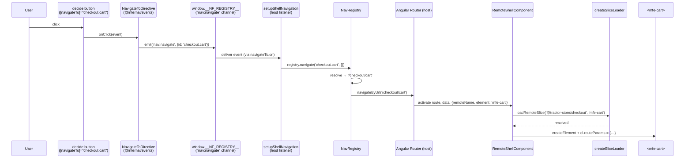
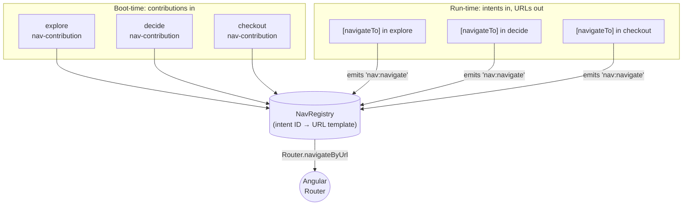

# Navigation

The Tractor Store has *one* router (in the host) and *zero* hard-coded
URLs in the remotes. A click in `decide` that should land on the cart
never mentions `/checkout/cart` — it emits the **intent** `checkout.cart`
and lets the host figure out the URL.

This document walks through how that works, why the intent system is the
load-bearing piece of the host/remote decoupling, and how a click in one
remote becomes a route activation in another.

## The problem with the obvious solutions

In a naïve micro-frontend setup, remote A linking to remote B picks one
of two bad options:

- **Hard-code the URL.** Now A breaks every time B reorganises its
  routes, and renaming `/checkout` becomes a coordinated multi-team
  migration.
- **Import B's routing module.** Now A and B are build-time coupled,
  share a router instance, and can't deploy independently.

Both options leak B's URL scheme into A. The intent system removes the
leak entirely by letting each remote keep ownership of its URLs while
exposing a stable, public name (the intent) to the rest of the world.

## The contract: `nav-contribution`

Each remote *exposes* (via `federation.config.mjs`) a `nav-contribution`
module. It is a single object describing what the remote routes:

```ts
// projects/explore/src/core/nav-contribution.ts
export const navContribution: NavContribution = {
  source: '@tractor-store/explore',
  basePath: 'explore',
  intents: [
    { id: 'explore.home',              path: '/',                    element: 'mfe-home' },
    { id: 'explore.products',          path: '/products',            element: 'mfe-category' },
    { id: 'explore.products.category', path: '/products/:category',  element: 'mfe-category' },
    { id: 'explore.stores',            path: '/stores',              element: 'mfe-stores' },
  ],
};
```

The shape (`libs/events/src/lib/nav-types.ts`):

- `source` — the federation remote name.
- `basePath` — the URL prefix the host will mount the remote under
  (`/explore`, `/decide`, `/checkout`).
- `intents[]` — every routable destination the remote owns:
  - `id` — the public name. Other remotes link to *this* string, never
    to a URL.
  - `path` — the path *inside* `basePath`, with optional `:param`
    segments.
  - `element` — the `mfe-*` custom element to render at that path.
- `navBar?` — optional contributions to a shared nav bar (intent ID +
  label + order). The registry exposes a sorted list of them via
  `getNavBar()`; the current build does not render one, but the slot is
  there for teams that want to add menu items without coordinating.

The intent ID is the only thing that crosses team boundaries. URLs and
element tags are an implementation detail of the owning team.

## Boot-time wiring

When the host starts, it loads every remote's `nav-contribution` in
parallel and uses them to build its router config and a *registry* of
intents.

The orchestration (`projects/host/src/app/nav/setup-shell-nav.ts`) is
small enough to read in full:

```ts
export const setupShellNavigation = async ({
  router,
  nf,
  manifest,
  onNavigate = (handler) => navigateTo.on(handler),
  fallbackRedirect = 'explore',
}): Promise<void> => {
  const loaded = await loadContributions(nf, manifest);

  const registry = new NavRegistry((url) => router.navigateByUrl(url));
  for (const { contribution } of loaded) registry.register(contribution);

  onNavigate(({ id, payload }) => {
    void registry.navigate(id, payload).catch((err) => {
      console.error(`[nav] navigation to intent "${id}" failed`, err);
    });
  });

  router.resetConfig([
    ...buildRemoteRoutes(loaded),
    { path: '**', redirectTo: fallbackRedirect },
  ]);
};
```

It does three things:

1. Calls `loadContributions` to fetch every remote's nav module
   (`projects/host/src/app/nav/load-contributions.ts`, using
   `Promise.allSettled` so one broken remote does not break the whole
   shell), builds a `NavRegistry` from them, and hands the registry a
   one-line navigator that calls `Router.navigateByUrl`. Note that the
   registry holds no Angular dependency — it is plain TypeScript and
   trivially unit-testable.
2. Subscribes to the **`nav:navigate`** channel on the bus
   (via `navigateTo.on(...)` from `@internal/events`). Every click in
   any remote that goes through `[navigateTo]` lands here, gets
   resolved by the registry, and finally hits the router.
3. Resets the Angular Router config with one route per intent. Every
   route lazy-loads the same `RemoteShellComponent`; only the route data
   differs:

   ```ts
   // projects/host/src/app/nav/remote-routes.ts
   routes.push({
     path: toRoutePath(contribution.basePath, intent.path),
     loadComponent: loadRemoteShell,
     data: { remoteName, element: intent.element },
   });
   ```

The DI adapter in `projects/host/src/app/nav/provide-shell-nav.ts` runs
this orchestration as an `appInitializer`, so by the time the user sees
the first frame the registry is populated and routing is wired.

## Linking from a remote: `[navigateTo]`

Remotes never type a URL and never inject `Router`. They use a directive
shipped from `@internal/events`:

```html
<a [navigateTo]="'checkout.cart'">Cart</a>
<button [navigateTo]="'decide.product'" [navParams]="{ id: product.id }">
  See details
</button>
```

The directive
(`libs/events/src/lib/navigate-to.directive.ts`) is intentionally tiny:

```ts
@Directive({
  selector: 'a[navigateTo], button[navigateTo], [navigateTo]',
  host: { '(click)': 'onClick($event)', '[style.cursor]': '"pointer"' },
})
export class NavigateToDirective {
  readonly navigateTo = input.required<string>();
  readonly navParams  = input<NavPayload>({});

  onClick(event: Event): void {
    event.preventDefault();
    navigateToChannel.emit({
      id: this.navigateTo(),
      payload: this.navParams(),
    });
  }
}
```

It listens for a click, prevents the browser's default navigation, and
emits one `nav:navigate` event with the intent ID and any parameters.
That's it — no URL computation, no router lookup, no router import
inside the remote.

> **Trade-off worth flagging.** Because the directive emits an event
> rather than producing a real `href`, browser features that rely on
> the `href` attribute — middle-click to open in a new tab, "copy link
> address", screen-reader URL announcements — do not currently work for
> `[navigateTo]` links. Restoring those is on the open follow-ups list
> in the main README.

A `[navigateTo]` to an unknown intent will reach the host, where the
registry logs `[nav] cannot navigate to unknown or unresolvable intent
"…"` and the navigation is dropped. A half-deployed system therefore
fails *visibly in the console* rather than silently in the URL bar.

## Reading params on the receiving end

Once the host's route activates, `RemoteShellComponent` mounts the right
custom element and writes a `routeParams` object onto it. The remote
component reads that object through Angular's component-input binding —
no DI needed:

```ts
// projects/decide/src/features/product/product.page.ts
readonly routeParams = input<RouteParams>({});

readonly id  = computed(() => param(this.routeParams(), 'id'));
readonly sku = computed(() => param(this.routeParams(), 'sku'));
```

`param`, `requiredParam`, and `paramList` are tiny helpers from
`libs/events/src/lib/route-params.ts`. They handle the
single-value-vs-array shape (multi-value query params come through as
arrays) and throw helpful errors for missing required params.

## End-to-end: a click in `decide` becomes a URL change



Notice what *isn't* in the diagram: no import from `decide` to
`checkout`, no shared `Router` instance, no string `'/checkout/cart'`
typed anywhere inside `decide`'s code. The only thing crossing the
boundary is the literal `'checkout.cart'`.

## Programmatic navigation: emit directly

`[navigateTo]` is for templates. From TypeScript, a remote can navigate
by importing the same channel handle and emitting through it:

```ts
// projects/checkout/src/features/checkout/checkout.page.ts
import { navigateTo, storeSelected } from '@internal/events';

onSubmit(event: Event): void {
  event.preventDefault();
  if (!this.isReady()) return;
  this.cart.clear();
  navigateTo.emit({ id: 'checkout.thanks' });
}
```

This is the same channel the directive uses, so any future intent-related
features (param validation, deep-link auditing, analytics) only need to
be added once at the host listener.

## The registry as a hub

Conceptually the navigation system is one big star:



Contributions flow into the registry once, at startup. After that, every
click in every remote routes through the single host-owned listener.
The registry itself never leaves the host — remotes only ever speak the
public intent ID.

## What this design buys you

Several payoffs fall out of the design:

- **Independent deploys.** A team can rename `/checkout/cart` to `/cart`
  by editing one path in their own `nav-contribution.ts`. No other
  remote needs to know — `checkout.cart` still resolves, just to a
  different URL.
- **No router import in remotes.** Remotes don't depend on
  `@angular/router` for navigation. The directive ships in a small
  shared library; the actual Router lives only in the host.
- **The host owns zero remote-specific knowledge.** It iterates over the
  contributions it loaded and builds routes generically — there is no
  `if (remoteName === 'checkout')` anywhere in the host code.
- **Testable in isolation.** Each remote runs standalone on its own port
  with the same `federation.manifest.json`. When `decide` boots on
  `:4202` it loads `mfe-header` from `:4201` (explore) and
  `mfe-add-to-cart` from `:4203` (checkout) just like the host would.
- **Standards-friendly.** All cross-app messaging goes through one tiny
  global (`window.__NF_REGISTRY__`). The bus is plain pub/sub; the only
  Angular-specific piece, `NavigateToDirective`, is ~30 lines.

The intent system is what turns "three Angular apps loaded into one
page" into "three independently-evolving products that happen to share
a shell".

## See also

- [Architecture](./architecture.md) — the runtime and custom-element
  bridge that the navigation layer rides on top of.
- [Features](./features.md) — the full list of intents per team.
